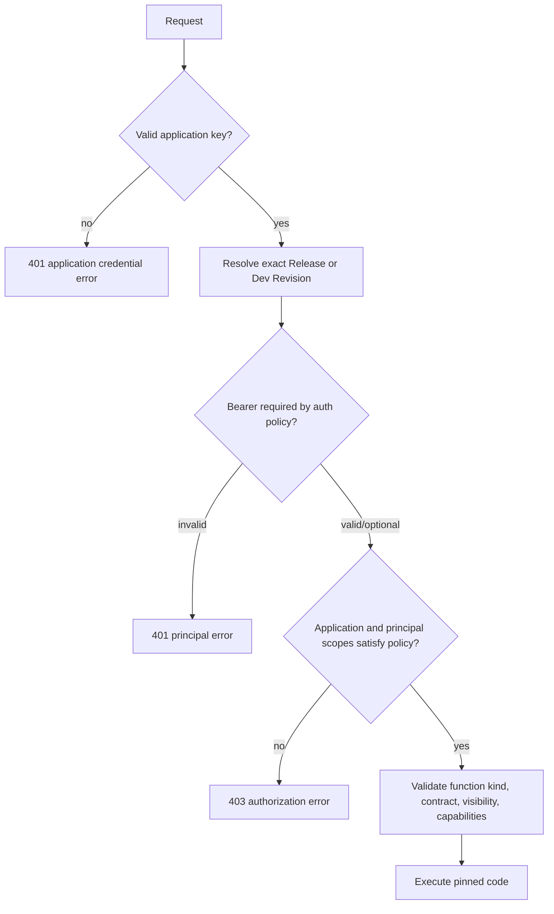

# Identity map

Runku deliberately separates who operates the platform, which application is calling, who the
Function acts for, who may publish development code, and which storage client may access a bucket.
Most integration errors come from collapsing two of these axes into one.

## The five credential families

| Family | Credential | Presented to | Establishes | Never establishes |
|---|---|---|---|---|
| Application | `rk_pub_v1_*` | Product HTTP/WebSocket | Public client identity and allowed application scopes | Confidentiality, user identity, operator authority |
| Application | `rk_sec_v1_*` | Product HTTP/WebSocket from a trusted server | Confidential client identity and allowed application scopes | User identity or Platform administration |
| Functional | guest token or configured JWT | Product HTTP/WebSocket | Guest/user/service principal and functional scopes | Application identity; an application key is still required |
| Development | `rk_dev_v1_*` | Development service | Actor and exact Environment allowed to create/publish Workspace revisions | Function invocation or management session |
| Platform | invitation, OIDC bearer, `rk_at_v1_*`, `rk_rt_v1_*` | Management service | Operator, device session, grants, and exact access scope | Application invocation without an application key |
| Runku Object Storage | bucket access/secret key or presigned authority | Runku Product storage path | Bucket operation and scope | Management, development, or Function identity |

Credentials are syntactically distinct and resolvers reject cross-family substitution. Do not put
secret application keys, development keys, refresh tokens, storage secrets, or invitation codes in
browser bundles, source control, URLs, logs, or telemetry.

## Product invocation authorization



Application assurance and functional principal kind are independent inputs to authorization. A
public browser key may identify an allowed application, but it is not a secret. A valid user JWT
without a valid application key is also insufficient.

Function `auth` policies are:

| Policy | Functional principal requirement | Typical use |
|---|---|---|
| `none` | No bearer principal required | Public configuration or server-authorized endpoint |
| `optional` | Anonymous or verified principal | Personalization that may be anonymous |
| `guest` | Valid guest principal | Temporary sessions |
| `user` | Valid user principal | End-user data and workflows |
| `service` | Verified confidential/service context | Trusted backend jobs and integrations |

The manifest also records `public` or `internal` visibility. Internal Functions are reachable only
through permitted nested/scheduled execution, not arbitrary public calls.

## Platform authorization

Platform grants combine an access boundary with a closed capability set:

```text
Installation
└── Project
    └── exact Environment
```

An Installation grant contains all current resources. A Project grant contains that Project and
its Environments. An Environment grant contains only the exact Project/Environment pair. The
Management router verifies both path IDs and the required capability before calling Product code;
wrong-scope resources may be returned as not found to avoid disclosure.

### Presentation roles

Roles are input conveniences expanded to explicit capabilities before persistence:

| Role | Intended authority | Deliberate exclusions |
|---|---|---|
| Owner | Complete capability set at the selected scope; initial owner is Installation-scoped | None inside the granted scope |
| Operator | Environment lifecycle, releases/channels, data/configuration/credentials/storage/Cron/logs/backups | Installation ownership, Project creation, operator-grant administration |
| Developer | Read Environment, publish/promote, invoke, data read/write, configuration/credential/storage read, Cron/schedule/log read | Secret/config mutation, credentials/storage mutation, retention, backups |
| Observer | Read Environment, releases, data, configuration metadata, credentials/storage/Cron/schedules/logs/usage | All mutation capabilities |

The authoritative answer is always the persisted capability set, not the role label originally
used to create it. See [Management API](../reference/management-api.md) for endpoint requirements.

## Platform session lifecycle

1. The fresh server writes a one-time initial-owner code to a private state path.
2. `runku login` exchanges an invitation or verified OIDC identity for an access/refresh pair tied
   to one named device session.
3. Access tokens are short lived. Refresh rotates the refresh credential; replay of the previous
   token fails.
4. Authorization is reloaded from the authority, so managed grant reconciliation affects existing
   sessions without issuing a new token.
5. Revoking a session invalidates both access and refresh credentials for that device.

Invitation codes and newly generated credentials are shown once. Idempotent creation replays safe
metadata but never reveals the secret again. If a create response is uncertain, reconcile by its
operation ID before issuing a replacement.

## Managed OIDC grants

A configured external verifier proves the OIDC token. A separate managed-enrollment secret proves
that the caller is allowed to create/reconcile local grants. The source authority and monotonically
increasing source revision own only their grant subset:

- equal revision plus equal canonical grant digest is a replay;
- equal revision plus different content is a conflict;
- lower revision is stale;
- another source authority cannot delete the first source's grants;
- an empty higher revision revokes that source's subset.

Configure the managed token and source authority as an exact pair. Do not expose the managed token
to browsers or ordinary operators.

## Rotation and incident rules

- Use overlapping application credentials: create/verify the replacement, deploy consumers, then
  revoke and finally delete the old credential.
- Rotate each operator device independently by logging in again and revoking the old session.
- Rotate Environment secrets by changing the exact entry under configuration revision CAS; a
  successful response never contains secret plaintext.
- Rotate the Platform Identity pepper only with a documented migration. Losing it can make stored
  token/key digests unusable; restoring mismatched identity state may resurrect revoked authority.
- On suspected disclosure, stop exposure first, preserve value-free audit/operation evidence,
  revoke the exact credential/session/source, and verify denial before resuming traffic.

Continue with [Application identity](application-identity.md) for Product calls and
[Platform operator identity](platform-identity.md) for bootstrap, OIDC, sessions, and recovery.
