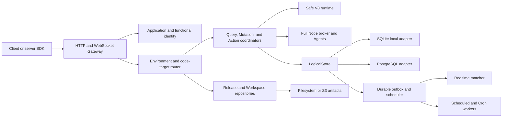

# System architecture

Runku is a modular Rust workspace deployed initially as a modular monolith with replaceable storage,
artifact, queue, and runtime adapters.

## Serving path

The Gateway authenticates application and functional identity, resolves an Environment and exact
code target, validates Function policy and contracts, and invokes the appropriate coordinator. A
request pins its resolved code identity for its entire lifetime.

## Data path

Query records a snapshot and dependency set. Mutation executes optimistic reads and writes, then
commits documents, logical indexes, outbox events, and schedules atomically. Realtime consumes only
committed outbox state.

## Runtime path

Safe V8 executes bounded ESM artifacts and Platform Ops. Full Node artifacts include an OCI
descriptor and Node bundle. The broker carries typed nested calls so application semantics remain
independent of runtime placement.

## Management path

Projects, Environments, Releases, Channels, Workspaces, keyrings, and serving revisions are durable
state. Serving uses the last valid snapshot during a temporary management-path outage; management
availability is not required for every application request.
