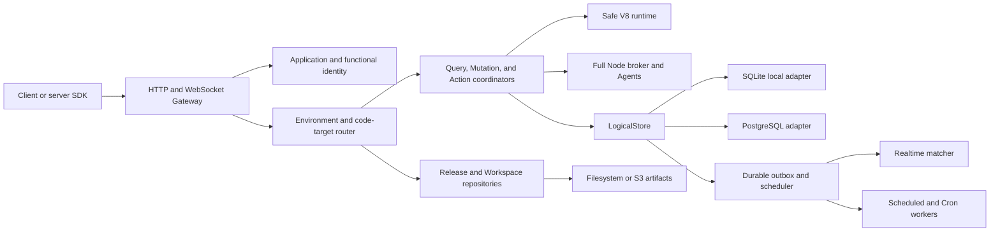

# System architecture

Runku is a modular Rust workspace deployed initially as a modular monolith with replaceable storage,
artifact, queue, and runtime adapters.

## Serving path

The Gateway authenticates application and functional identity, resolves an Environment and exact
code target, validates Function policy and contracts, and invokes the appropriate coordinator. A
request pins its resolved code identity for its entire lifetime.

## Data path

Query records a snapshot and dependency set. Mutation executes optimistic reads and writes, then
commits documents, logical indexes, outbox events, and schedules atomically. Realtime consumes only
committed outbox state.

## Runtime path

Safe V8 executes bounded ESM artifacts and Platform Ops. Full Node artifacts include an OCI
descriptor and Node bundle. The broker carries typed nested calls so application semantics remain
independent of runtime placement.

Application file storage is a Platform Op and HTTP transfer boundary, not direct runtime access to
a filesystem or S3 credentials. The Product process owns Environment-scoped metadata, quota
reservation, grant signing, and lifecycle reconciliation; `runku-file-storage` maps generated keys
to a dedicated filesystem or S3-compatible prefix. Large bodies stream through the Gateway. The
external byte backend is a privileged dependency whose durability and backup remain operator-owned.

## Management path

Projects, Environments, Releases, Channels, Workspaces, keyrings, and serving revisions are durable
state. Serving uses the last valid snapshot during a temporary management-path outage; management
availability is not required for every application request.

Platform operator identity is a separate admission boundary for this path. The current source
composition persists operators, external identity links, scoped capability grants, invitations,
device sessions, and security audit in PostgreSQL. Application and development credentials cannot
cross into it. The exposed source Management API covers bootstrap/login/session/invitations and,
when one Product Environment is attached, capability-scoped Workspace publication, Release and
Channel lifecycle, status, and Operational Log snapshot/stream operations. It does not yet compose
every distributed management domain named above.

The attached Environment independently selects SQLite or an exact-scope PostgreSQL `LogicalStore`.
The latter persists an atomic singleton Project/Environment binding before use and is checked by
Management readiness. It never reuses Platform Identity as Product authority and never falls back
to SQLite after a PostgreSQL failure.

## Component boundaries

| Component | Owns | Must not own |
|---|---|---|
| Gateway | transport, identity admission, target resolution, envelopes | direct SQL/business logic |
| Execution coordinators | Query/Mutation/Action/nested semantics | physical storage/runtime placement |
| LogicalStore | snapshots, atomic commits, outbox, schedules | HTTP or Function source parsing |
| Release/Development repositories | manifests, lifecycle, Channels, Workspace revisions | application documents |
| Runtime supervisor/Agents | bounded artifact execution and Platform Ops bridge | target/auth policy decisions |
| Realtime | subscription lifecycle/dependency matching | pre-commit events or business authorization bypass |
| Background workers | outbox/schedules/Cron materialization with leases | changing pinned code |
| Identity | Application/functional trust and policy | application resource ownership |
| Observability | scoped events, hot log tier, archive/journal, historical query | billing authority or authorization decisions |

## Consistency and ownership

Serving resolves one Environment and exact code identity before execution. Mutation commits data,
indexes, outbox, and schedules atomically. Dispatch/worker delivery is at-least-once and uses durable
identity plus lease/fencing. Artifacts publish before pointers. Mutable pointers use compare-and-set.
Unknown scope/version/runtime fails closed.

## Process topology

A packaged distribution may compose `api`, `background`, `management`, and optional Full Node
`agent` roles, or an `all` role for a dedicated instance. Role separation changes process placement,
not semantics or sources of truth. API/background/management do not require KVM. Only the selected
shared-untrusted Full Node Agent profile receives host isolation privileges.

Operational Logs follow the same composition rule. Local/standalone embeds capture, SQLite hot
storage, filesystem or S3 Parquet archival, and DuckDB query in the Product process. The optional HA
profile adds a replicated JetStream durability boundary and runs the archive loop as
`runku-server logs-worker` from the same artifact. It does not require splitting other roles.
Serving publishes exact-scope cursor-ordered records and waits for PubAck; a worker commits the
Parquet object and strict manifest before explicit ACK. Query merges verified archive rows with
newer hot rows. Raw Product logs never enter Platform Identity PostgreSQL.

## Failure containment

- management outage: serve last valid known revision; reject unknown changes;
- PostgreSQL outage: affected authoritative operations fail/unready, never fall back to local state;
- artifact outage: cached verified artifacts may serve within policy; unknown content fails;
- outbox/worker crash: durable records replay with idempotent handling;
- Realtime socket loss: clients reconnect and resync authoritative Query state;
- Agent loss/uncertain Node result: queue/reconcile and replace worker; never report uncertain success;
- telemetry outage: bounded buffering/drop accounting without blocking authoritative state;
- log journal/archive outage: retain admitted hot rows and pending journal deliveries; never prune
  beyond the verified immutable archive frontier;
- incompatible Release/config: reject activation/promotion before serving.

## Scaling constraints

API scales by admission, latency, WebSocket/subscription load, and storage pools. Background scales by
outbox/schedule/Cron lag with lease correctness. Full Node scales by queue age and available slots.
Management scales independently and is not on every request path. Every cache/pool/queue carries
Project/Environment/code scope and a bounded capacity policy.

## Evolution rule

New adapters implement existing traits and pass common conformance. A new public or persisted
contract is versioned before crossing its boundary. Do not implement semantic shortcuts in one
process profile. See [Repository map](repository-map.md) and
[Evolving Runku](../development/evolving-runku.md).
