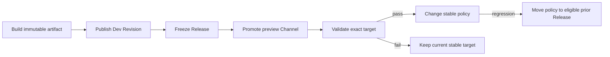

# Operator handbook

This handbook is the top-level operating loop for a compact Runku Self-Hosted installation. It
links each signal to the authority that owns it and separates application rollout, Product health,
dependency recovery, and server upgrade decisions.

## Operating model

| Plane | Owned by | Primary authority | First health question |
|---|---|---|---|
| Application traffic | application/platform operator | Channel/serving policy | Which exact Release is receiving this request? |
| Product execution | platform operator | gateway/runtime + Product repositories | Is the Product listener ready and admitting work? |
| Application state | data/storage operator | logical store + file/object bytes | Can committed state be read and recovered consistently? |
| Administration | installation owner | Platform Identity PostgreSQL | Can an authorized operator authenticate at the exact scope? |
| Operational evidence | observability operator | hot log tier + verified archive | Is the queried window complete and is prune frontier safe? |
| Host/dependencies | infrastructure operator | Docker, host, PostgreSQL, S3, NATS, TLS | Which dependency failed before or after a durable boundary? |

Application and platform credentials are independent. Break-glass operator access must not depend
on a publishable/secret Application Key or a functional user token.

## Establish a baseline

Record after installation and after every approved upgrade:

- server, CLI, SDK, package, PostgreSQL, proxy, and optional dependency versions;
- OCI manifest digest and release checksum/provenance result;
- exact Project/Environment IDs and Environment protection/purpose;
- Product/Management public origins and private loopback upstreams;
- enabled overlays and state location/backup owner for every authority;
- current Channel/serving revisions and eligible rollback Releases;
- resource ceilings, measured steady state, alert thresholds, and restore objective;
- last verified backup and restore-drill evidence;
- named owners and escalation route for application, identity, data, storage, and infrastructure.

Do not record peppers, tokens, DSNs, Application Keys, object keys, Function arguments, or secret
configuration values in the baseline.

## Routine checks

### Per shift or automated continuously

1. Run `./runku-selfhost status` and confirm PostgreSQL and Management readiness.
2. Probe public HTTPS/WSS through the proxy, not only loopback, and verify certificate/DNS expiry.
3. Check Product `/healthz` and `/readyz` after at least one Channel is serving.
4. Read authenticated Environment instance health and fixed-name metrics.
5. Check error/latency/admission, runtime queue/deadline, data conflict/pool, outbox/schedule/Cron
   lag, Realtime reconnect/resync, file quota/free space, and log archive lag.
6. Confirm no alert is hidden by missing telemetry; telemetry loss is its own incident.

`GET .../instances/healthz` reports sanitized fixed components and may call an unpublished runtime
`idle` rather than unhealthy. `GET .../metrics` contains Product aggregates, not Platform Identity
security audit or billing truth.

### Daily

- review failed/denied operations by stable code and request/invocation correlation;
- verify disk and PostgreSQL headroom against growth and backup staging needs;
- check pending file usage events and external-S3/NATS provider errors when configured;
- verify the Operational Log archive frontier advances before any prune window;
- inspect due/leased/failed schedule and Cron outcomes for unexpected at-least-once repeats;
- reconcile active operator sessions, new invitations, credential rotations, and managed-source
  revision failures.

### Per backup interval

```sh
./runku-selfhost backup /mnt/encrypted/runku-backup-YYYY-MM-DD kms://policy/key-version
./runku-selfhost verify-backup /mnt/encrypted/runku-backup-YYYY-MM-DD
```

Store the verification result, manifest digest, external-S3 recovery-point identity when relevant,
and retention decision. A backup not verified is not a recovery point.

### Periodically and after material changes

- restore into an empty isolated installation;
- authenticate and verify exact scope, Channels, Query/Mutation, Realtime, schedules, files, and logs;
- rotate an operator session and application credential through the full overlap/revoke procedure;
- run a Channel rollback drill using an eligible immutable Release;
- test dependency loss and graceful host restart without deleting evidence;
- update capacity measurements and alert calibration.

## Safe change procedure

For configuration, credential, dependency, or application changes:

1. **Define intent:** exact scope, expected revision, owner, rollback point, maintenance impact.
2. **Read current state:** never infer it from a prior console page or `latest`.
3. **Preserve evidence:** relevant status, non-secret config hash, logs/cursors, and backup.
4. **Preflight:** compatibility, secret mounts, capacity, dependency and target authorization.
5. **Apply once:** use one durable operation ID for one exact intent.
6. **Reconcile:** if the response is uncertain, query operation/current state before retrying.
7. **Verify:** public path, durable state, worker lag, logs, security audit, and recovery validity.
8. **Close:** record final revision/target and remove expired overlap credentials.

Never reuse an idempotency key for changed content. Never turn a transient timeout into a second
Action or state mutation without reconciliation.

## Application rollout



Before promotion, read the delivery/status snapshot and run the revision-bound
`POST .../serving-policy/preflight` against the candidate. Require an empty blocker list, artifact
integrity, application tests, and enough capacity for all weighted Releases. A conflict means the
Release/Channel or policy revision advanced; repeat the read and review rather than reusing stale
evidence. During observation, segment signals by exact Release without unbounded labels. Rollback
changes traffic policy; it does not undo data mutations, external Action effects, configuration
rotations, or a server schema migration.

An optional document field may coexist across old/new Releases: reads are Release-projected and an
old full replace preserves fields outside its view. Required additions and index/Cron changes remain
blocked until their data/backfill/readiness prerequisite is explicit. Verify rollback through both
old and new exact targets before changing traffic weights.

After the agreed rollback window, remove the old Release from Channels and policy, disable its Cron
activations, and drain or cancel pending Scheduled Invocations. Retire it using the exact revisions
from `GET .../delivery`; a conflict means a reference or revision changed and must be reviewed.

## Identity administration

Use the narrowest grant at Installation, Project, or exact Environment scope. Review role expansion
before persistence; a role name is not runtime authority. Important separations:

- invitation/bootstrap → operator enrollment only;
- operator access/refresh tokens → Management only;
- `rk_dev_*` → Workspace publication only;
- `rk_pub_*`/`rk_sec_*` → Application identity only;
- functional JWT/guest/service identity → Function auth only;
- object-storage access key → bounded bucket/prefix path only.

On suspected compromise, revoke the credential/session at its authority, inspect transactional audit
and relevant Product logs, rotate dependent material, and verify no broader role was assumed. Do not
solve an application credential event by rotating the Platform pepper.

## Logs and evidence

Start with a bounded snapshot:

```sh
runku logs --remote --limit 100
```

Continue with the exclusive cursor and filter by exact request, invocation, client, credential, or
Release as needed. `--follow` is one authenticated NDJSON stream; it is reauthorized and ends after
revocation/grant loss. Persist only the last confirmed cursor.

Before pruning:

```sh
runku logs archive-status --remote
runku logs prune --remote --before-micros <cutoff>
runku logs prune --remote --apply --environment env_... --before-micros <cutoff>
```

Use exact CLI syntax supported by the selected version. The prune plan must not cross the verified
immutable archive frontier. OTLP delivery is an additional telemetry copy and never proves archive
coverage or billing usage.

## Incident triage

Preserve state and timestamps before restarting. Determine the failing plane:

| Symptom | First evidence | Immediate containment |
|---|---|---|
| Management down, Product still serving | loopback probe, PostgreSQL, identity logs | freeze administrative changes; keep application path isolated |
| Product not ready | Channel/serving observation, runtime/artifact/data health | stop promotion; route only to known converged Release if safe |
| Error spike on one Release | exact-target metrics/logs and compatibility | move Channel weights/rollback; preserve the Release for diagnosis |
| Mutation timeout | operation ID, result lookup/current document | reconcile before retry; avoid a new operation ID |
| Action timeout | downstream idempotency and effect record | assume possible effect; never automatic replay |
| Realtime gap/resync spike | outbox/dispatcher lag, connection close/resync codes | clients reconnect and accept fresh Query snapshot |
| PostgreSQL unavailable | dependency health and connection/pool errors | stop state-changing operations; restore service before writes |
| Product disk pressure | free-space floor, file reservation, logs/artifacts growth | stop new large writes; preserve and expand/clean only through owned procedures |
| External S3 missing/corrupt | provider version/recovery point + Product metadata | close affected file/object access; do not delete metadata as repair |
| Log archive stopped | hot tier/journal depth, archive status | protect hot capacity; do not prune |
| Suspected secret leak | identity/config audit without secret values | revoke/rotate exact credential; prevent secret from entering diagnostics |

## Restart and shutdown

Use package commands and allow the configured 30-second grace period. A restart is not a repair for
corruption and can remove volatile evidence. Before a planned stop, stop promotions, observe in-flight
and worker queues, ensure dependencies are durable, and record current revisions. After restart,
verify Management readiness, exact Product scope, serving convergence, background lag, and one
end-to-end application call.

## Restore decision

Restore only for loss/corruption that cannot be repaired through the owning authority. Restoration
requires an empty configured target, complete verified backup, matching protected key material, and
coordinated external-S3 state. It may resurrect revoked sessions/invitations, move log cursors
backward, and replay at-least-once work. Reconcile all three before reopening traffic.

Follow [Backup and recovery](backup-and-recovery.md); never copy individual live SQLite files and
call the result a backup.

## Escalation package

Provide version/digest, UTC time window, exact scope and target IDs, request/invocation/operation
IDs, stable error codes, bounded log cursor range, sanitized dependency health, most recent change,
and backup/archive status. Exclude credentials, payloads, source, artifact bytes, user-controlled
labels, and secrets.

Use [Administration](administration.md) for resource procedures,
[Observability](observability.md) for the signal catalog, and
[Troubleshooting](../reference/troubleshooting.md) for stable failures.
