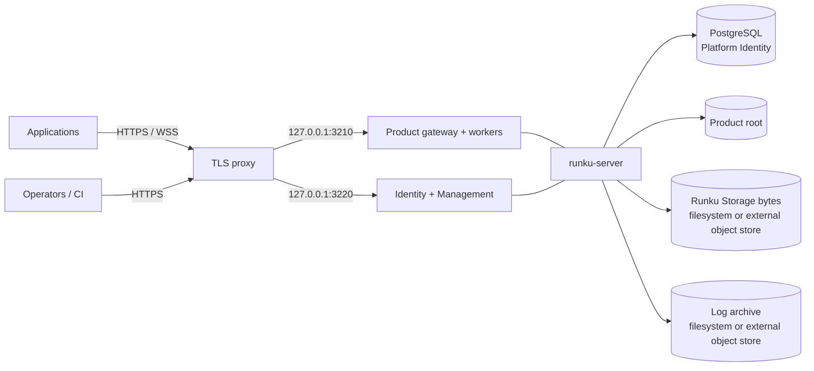

# Deploy the compact Self-Hosted profile

This is the decision and execution guide for the currently supported Runku Self-Hosted shape: one
initialized Safe V8 Product Environment, one active Product writer, PostgreSQL-backed Platform
Identity, and the released Docker Compose package. An explicit dedicated-host option can run Full
Node workers inside the same container when the whole installation is one trust domain. It is not
a generic Kubernetes, active-active, or shared Full Node Agent installation.

## Decide whether this profile fits

Use the compact profile when all of these are true:

- one Product Environment per installation is an acceptable administrative boundary;
- one active writer and host-level maintenance windows fit the availability objective;
- application Functions fit Safe V8 capabilities, or trusted Full Node Actions use the explicit
  dedicated-host profile and its operator-enforced whole-instance limits;
- the team can operate Docker/Compose, PostgreSQL, TLS, encrypted backups, and an optional external
  S3-compatible object-store backend;
- the team accepts that Product-root authorities remain local even if Function data uses PostgreSQL;
- recovery time is based on restoring a coordinated recovery point, not automatic failover.

Do not use it as a shared hostile-tenant Node boundary, a multi-Environment control plane, or a
claim of rolling upgrades. Shared untrusted Full Node needs a VM-grade boundary and the repository
does not yet publish the required Agent/topology. Apply the
[production-readiness contract](production-readiness.md) if these limits do not fit; its unmet items
are acceptance criteria, not hidden features.

## Know what you will operate



The Product listener starts lazily after the first successful Channel promotion. Management
readiness on `127.0.0.1:3220` is the installation probe before application code exists.

### Durable-state inventory

| State | Default placement | Recovery owner |
|---|---|---|
| Platform operators, sessions, grants, invitations, audit | PostgreSQL 16 | Runku package + database operator |
| Releases, Workspaces, Channels, application identity, Cron, serving, configuration | Product root SQLite/files | Runku package |
| Documents, indexes, outbox, schedules | Product root SQLite | Runku package |
| Optional Function logical store | separate exact-scope PostgreSQL database | database operator + Runku migration |
| Immutable artifacts | Product root | Runku package |
| Application files/object bytes | dedicated `files/` directory | Runku package |
| Optional application bytes | external S3-compatible prefix | storage operator |
| Operational logs | Product hot SQLite + filesystem/S3 Parquet | Runku package or storage operator |
| Pepper, database URL, S3 credentials | external mounted secret files | secret-management operator |

`RUNKU_PLATFORM_DATABASE_URL` moves only documents/indexes/outbox/schedules. It does not remove the
Product root or the need to back it up.

## Prerequisites

Prepare a dedicated Linux host or VM with:

- Docker Engine and Compose v2;
- `openssl`, `jq`, and `tar` for package lifecycle helpers;
- a TLS reverse proxy already governed by the operator;
- absolute data, secret, and encrypted-backup paths;
- an unprivileged UID/GID that owns only the Runku data roots;
- enough disk for Product state, PostgreSQL, files, log archive, backup staging, and free-space floor;
- time synchronization and an incident-access path independent from application identity.

Keep the two loopback listeners inaccessible from other hosts. If the host networking model cannot
guarantee that, stop and design an equivalent private boundary before starting Runku.

## Obtain and verify a release

Download the versioned Self-Hosted archive, its checksum file, and release provenance from the same
GitHub release. Verify the archive against `SHA256SUMS`, inspect the tag's compatibility and upgrade
notes, and record the published OCI manifest digest. Do not deploy a mutable tag alone.

```sh
sha256sum --check SHA256SUMS --ignore-missing
tar -xzf runku-selfhost-vX.Y.Z.tar.gz
cd runku-selfhost-vX.Y.Z
cp .env.example .env
chmod 0600 .env
```

Replace placeholders in `.env` with the exact image tag **and** manifest digest. Set absolute
`RUNKU_DATA_DIRECTORY` and `RUNKU_SECRETS_DIRECTORY`, the owning `RUNKU_UID`/`RUNKU_GID`, and the
canonical public HTTPS Management origin. Keep `RUNKU_DEPLOYMENT_PROFILE=standalone` for the first
installation unless the recovery design already requires an overlay.

## Select storage and browser overlays

| Profile selection | Adds | Required decision |
|---|---|---|
| `standalone` | dedicated local file bytes and local log archive | coordinated host backup |
| `browser` | exact browser origins and Product JWT descriptor | origin/provider trust and rotation |
| `s3-files` | external application file/object bytes | bucket/prefix durability and coordinated restore |
| `s3-logs` | external immutable log history | archive credentials, retention, query availability |
| `ha-logs` | NATS journal plus S3 archive workers | replicated journal capacity and worker operation |

Overlay combinations are named in the packaged Docker guide. S3/NATS overlays improve the named
storage boundary; they do not create active-active Product writers. The bucket must exist. Runku
does not operate the provider's encryption, replication, lifecycle, versioning, or backup.

## Configure without serving

```sh
./runku-selfhost configure
```

The helper creates the PostgreSQL password, matching database URL, and 256-bit Platform Identity
pepper as mode-`0600` files. It never replaces existing secrets and rejects a partial set. Review
directory ownership and file modes before continuing. Secrets do not belong in `.env`, shell
arguments, source control, or diagnostics.

Configuration validation is fail-closed. The underlying image supports:

```sh
runku-server check
runku-server version
```

Use the package helpers for the released topology so the correct mounts and environment are
present. See [Server configuration](server-configuration.md) for every supported input.

## Initialize and start

```sh
./runku-selfhost start
./runku-selfhost status
```

Startup initializes the exact Product scope, prepares local credentials, checks/migrates storage,
starts PostgreSQL and the server, and waits for Management readiness. It is idempotent for identical
state and rejects divergent Product identity.

Keep `RUNKU_FULL_NODE_PROFILE=disabled` for Safe-only applications. For trusted Node Actions on a
host dedicated to this one Product trust domain, set these values in `.env` before start or during a
controlled restart:

```dotenv
RUNKU_FULL_NODE_PROFILE=dedicated-host
RUNKU_FULL_NODE_MAX_CONCURRENCY=1
RUNKU_FULL_NODE_HEAP_MEGABYTES=256
RUNKU_FULL_NODE_INSTANCE_CPU_MILLIS=2000
RUNKU_FULL_NODE_INSTANCE_MEMORY_BYTES=2147483648
RUNKU_FULL_NODE_INSTANCE_PIDS=512
```

The last three values match the package defaults `RUNKU_CPU_LIMIT=2.0`,
`RUNKU_MEMORY_LIMIT=2g`, and `RUNKU_PIDS_LIMIT=512`. Keep both sets aligned whenever one changes;
the declarations do not create a second cgroup inside the server. Verify `./runku-selfhost status`, publish a
Node built-in smoke Action, invoke it twice, and confirm both success and bounded worker reuse in
diagnostics before admitting traffic. To roll back the capability, stop Node traffic, set the
profile to `disabled`, restart, and verify that Safe Releases still serve while new Node publication
is rejected. Existing Node Releases remain durable but cannot execute until a compatible runtime
is restored.

The initial-owner invitation is written under the data directory at
`platform/bootstrap/initial-owner.code`. Protect and consume it through the procedure in
[Platform operator identity](../auth/platform-identity.md#enroll-the-initial-owner). Successful
consumption creates an operator session; it does not create an Application Client or functional
user identity.

## Terminate TLS and expose only intended routes

Configure two exact proxy routes:

| Public route | Upstream | Proxy requirements |
|---|---|---|
| Application HTTPS/WSS | `127.0.0.1:3210` | WebSocket upgrade/streaming, bounded bodies/timeouts, exact Origin behavior |
| Authentication/Management HTTPS | `127.0.0.1:3220` | no auth-response caching, bounded body/stream timeouts, no redirects during CLI discovery |

Forward only headers explicitly trusted by the proxy policy. Block direct access to both upstreams,
strip untrusted forwarding headers, set request/body/time limits compatible with documented Runku
bounds, and test WebSocket idle behavior. `RUNKU_MANAGEMENT_TLS_TERMINATED=true` is only for a
deployment that actually provides a trusted TLS termination boundary; it is not a TLS switch.

Success evidence before code publication:

- `./runku-selfhost status` reports PostgreSQL healthy and Management ready;
- public Management discovery uses the exact configured HTTPS origin without redirect;
- the Product upstream's absence before first promotion is understood, not masked as readiness;
- unauthorized Management and direct-upstream requests fail;
- restart preserves Product and operator identity.

## Publish the first application

Place the application's `runku/` source in the initialized Product root or build from a protected
CI copy with the exact scope. Use a matching CLI on an operator machine:

```sh
runku login --url https://management.example.com
runku build --root /srv/runku/product
runku publish --remote --root /srv/runku/product \
  --manifest /exact/build/manifest \
  --artifact /exact/build/artifact \
  --expected-head empty
runku release --remote --root /srv/runku/product --release rel_...
runku promote --remote --root /srv/runku/product \
  --channel stable --release rel_... --expected empty
runku status --remote --root /srv/runku/product
```

Use actual paths, IDs, and revisions from JSON output. The first successful promotion starts the
Product listener. Validate `/healthz`, `/readyz`, a Query, idempotent Mutation, Action policy,
Realtime reconnect, a schedule, files if enabled, and correlated logs.

## Establish recovery before production

On an encrypted destination:

```sh
./runku-selfhost backup /mnt/encrypted/runku-backup-YYYY-MM-DD kms://policy/key-version
./runku-selfhost verify-backup /mnt/encrypted/runku-backup-YYYY-MM-DD
```

The standalone helper briefly stops serving and coordinates PostgreSQL, Product, Platform, and
dedicated `files/` state. External secret files are intentionally separate. An external-S3 profile
fails closed until the operator supplies a verified provider recovery point; metadata alone is not
a complete backup.

Perform an empty-install restore drill before production and at the documented cadence. Validate
identity, exact scope, credentials, Channels, data, Realtime, schedules, file bytes, hot/archive log
boundary, and revocation reconciliation. See [Backup and recovery](../operations/backup-and-recovery.md).

## Operational acceptance

Before opening traffic, assign named owners and evidence for:

- release/image/checksum provenance;
- TLS/DNS/proxy and application/provider identity;
- PostgreSQL, Product root, files/S3, logs, and secret recovery;
- resource ceilings, free-space floor, concurrency, and alert thresholds;
- operator grants, session/invitation review, and break-glass access;
- deploy/rollback versus server upgrade/database rollback decisions;
- maintenance window, graceful stop, and incident communications.

Run the complete [hardening checklist](../security/hardening-checklist.md),
[capacity plan](../operations/capacity-planning.md), and
[operator handbook](../operations/operator-handbook.md).

## Failure and retry rules

| Failure | Durable uncertainty | Safe action |
|---|---|---|
| `configure` partial secret set | no safe derived set | preserve files, correct the set; never regenerate one member blindly |
| initialization identity conflict | existing Product scope differs | stop and resolve target; do not delete the root |
| Management not ready | dependency/migration/identity may be unavailable | inspect status and logs; retry start only after state is understood |
| publish/promote response lost | operation may have committed | query operation/current status before retry |
| Action response lost | external effect may have occurred | reconcile downstream idempotency record |
| disk/S3 unavailable | Product metadata or bytes may diverge | stop affected writes; preserve evidence; restore only from coordinated point |
| upgrade migration fails | new durable schema may have begun | follow release rollback limit; Channel rollback is not database downgrade |

Removal is destructive. Use the package's guarded `uninstall` procedure only after a verified,
retained recovery point and explicit confirmation. It removes the scoped installation resources;
provider-owned external buckets, archives, DNS, certificates, and secret-manager versions require
their own separately approved lifecycle.
